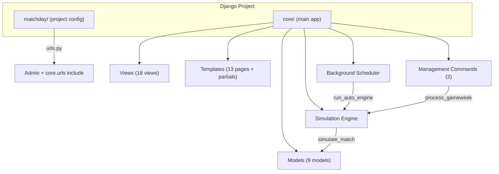

# MatchDay — Repository Analysis

## Overview

**MatchDay** is a full-stack Django (5.2) Fantasy Premier League simulation web app built for a University of Łódź Application Servers course. It combines a **match simulation engine** with an interactive **fantasy team management dashboard**.

| Aspect | Detail |
|---|---|
| **Framework** | Django 5.2.12 + Jazzmin admin theme |
| **Database** | SQLite (`db.sqlite3`, ~3.4 MB — seeded with data) |
| **Frontend** | Django templates + Vanilla JS + Chart.js (AJAX/Fetch) |
| **Python deps** | `Django==5.2.12`, `django-jazzmin==3.0.0` |

---

## Git State

| Item | Value |
|---|---|
| **Current branch** | `presentation-lite` |
| **Other branches** | `main` (local), `origin/main` (remote) |
| **Working tree** | ✅ Clean — nothing to commit |
| **Branch divergence** | `presentation-lite` and `main` are **identical** (0 diff) |
| **Latest commit** | `e7dd390` — *Feature: Added Visual System Architecture Dashboard for Presentation* |

> **Note:** Since `presentation-lite` = `main` with no divergence, creating a new branch from here gives a clean base.

---

## Architecture

---

## Data Models — [`core/models.py`](../core/models.py)

| Model | Purpose | Key Relations |
|---|---|---|
| `Team` | PL club (name, colors, logo) | → Players |
| `Player` | Individual player (position, price, injury) | → Team, → PlayerStat, → FantasyPick |
| `Gameweek` | Season week (deadline, active flag) | → Match, → FantasyTeam |
| `Match` | Fixture (home/away, scores, played flag) | → Team×2, → Gameweek |
| `PlayerStat` | Per-match stats (goals, assists, mins, FPL pts) | → Player, → Match |
| `FantasyTeam` | User's squad for a gameweek (bank, formation, pts) | → User, → Gameweek |
| `FantasyPick` | A player slot in a fantasy team | → FantasyTeam, → Player |
| `League` | Private mini-league (UUID code) | → User (creator) |
| `LeagueMember` | League membership join table | → League, → User |
| `Notification` | In-app notification | → User |
| `Transfer` | Transfer log (in/out) | → User, → Gameweek, → Player×2 |

---

## URL Routes — [`core/urls.py`](../core/urls.py)

| Route | View | Auth? | Purpose |
|---|---|---|---|
| `/` | `index` | No | Dashboard / landing page |
| `/auth/login/` | `auth_login` | No | Login |
| `/auth/register/` | `auth_register` | No | Registration |
| `/auth/logout/` | `auth_logout` | No | Logout |
| `/profile/` | `user_profile` | Yes | User's history & leagues |
| `/pick/` | `pick_team` | Yes | Squad builder UI |
| `/pick/save/` | `save_picks` | Yes | AJAX squad save endpoint |
| `/leaderboard/` | `leaderboard` | Yes | Global rankings + player stats |
| `/fixtures/` | `fixtures` | Yes | Fixture hub + PL standings table |
| `/players/` | `players` | Yes | Team browser |
| `/teams/<short>/` | `team_detail` | Yes | Team squad view |
| `/leagues/create/` | `create_league` | Yes | Create private league |
| `/leagues/join/` | `join_league` | Yes | Join via code |
| `/leagues/<code>/` | `league_detail` | Yes | League standings |
| `/simulate/` | `simulation_center` | Yes | Manual simulation trigger |
| `/architecture/` | `architecture_view` | Yes | System diagram page |
| `/api/totw/` | `get_team_of_the_week` | Yes | JSON: TOTW data |
| `/api/player/<id>/` | `get_player_detail` | Yes | JSON: Player stat history |
| `/api/notifications/` | `get_notifications` | Yes | JSON: Notification feed |

---

## Simulation Engine

### [`core/simulation.py`](../core/simulation.py)
- **`simulate_match(match)`** — Weighted-random score generation, distributes minutes/goals/assists to squad, calculates FPL points via positional scoring
- **`simulate_gameweek(gw)`** — Runs all matches, then processes every user's fantasy team: captaincy logic, vice-captain fallback, auto-subs (respecting 3-2-1 formation constraints)
- **`update_player_prices(gw)`** — Stub (not implemented)

### [`core/scheduler.py`](../core/scheduler.py)
- Background daemon thread (`run_auto_engine`) polling every 60s
- Staggered match simulation: plays matches once their `match_date` passes
- Conditional rollover: auto-advances gameweek when deadline passed + all matches played

### Management Commands
| Command | File | Purpose |
|---|---|---|
| `process_gameweek` | [`process_gameweek.py`](../core/management/commands/process_gameweek.py) | Simulate → clone teams → advance GW |
| `create_demo_league` | [`create_demo_league.py`](../core/management/commands/create_demo_league.py) | Seed demo data |

---

## Templates

13 page templates + auth partials in `core/templates/core/`:

| Template | Purpose |
|---|---|
| `base.html` | Base layout (nav, notifications, admin banner) |
| `index.html` | Dashboard with recent matches & user team |
| `pick_team.html` | Squad builder (largest template — 29KB) |
| `leaderboard.html` | Global rankings + player stat carousels |
| `fixtures.html` | Fixture list + PL standings table |
| `league_detail.html` | Private league view with MVPs |
| `profile.html` | User history chart |
| `players.html` | Team browser |
| `team_detail.html` | Individual team squad |
| `simulation_center.html` | Manual simulation trigger |
| `architecture.html` | System architecture diagram |
| `create_league.html` / `join_league.html` | League forms |

---

## Notable Observations

- ✅ **Clean state** — working tree is clean, branches are synced. Good starting point for a new feature branch.
- `Transfer` model exists in models.py but **no dedicated transfer view/page** uses it — transfers are handled inline in `save_picks`
- `update_player_prices()` is a **stub** (just `pass`)
- The `{matchday,core` directory at root and inside `matchday/` looks like a **brace expansion artifact** from a mistyped shell command — harmless but messy
- `@csrf_exempt` on `save_picks` and `league_detail` — functional but not ideal for production
- The `admin.py` registers `display_name` in `search_fields` but `display_name` is a `@property`, not a DB field — this will raise an error if admin search is used
